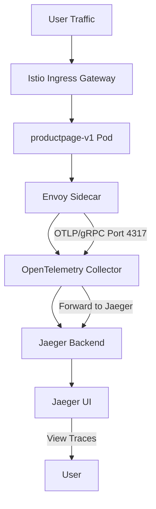

 
# Distributed Tracing in a Service Mesh

## Overview

Before diving into the implementation, let's understand how distributed tracing works in the context of Istio and Jaeger.

In this architecture:
- Envoy sidecars automatically inject and propagate trace headers
- Each service reports its spans to the Jaeger collector
- Jaeger aggregates spans into complete traces for visualization

## Prerequisites

Before starting, ensure the following components are available:
- Kubernetes cluster (v1.24+)
- `kubectl` configured
- Istio installed
- `istioctl` CLI installed (v1.20+)
- Sample Bookinfo application deployed
- Basic understanding of Kubernetes and service mesh concepts

## Installing Jaeger Addons in Istio

Istio provides sample observability addons including:
- Jaeger
- Prometheus
- Grafana
- Kiali

Install them using:
```bash
kubectl apply -f samples/addons
```

Verify installation:
```bash
kubectl get pods -n istio-system
```

## Exposing Jaeger UI Externally

### Option 1: NodePort (Quick and Simple)

Patch the Jaeger tracing service:
```bash
kubectl patch svc tracing -n istio-system -p '{
  "spec": {
    "type": "NodePort",
    "ports": [
      {
        "port": 80,
        "targetPort": 16686,
        "nodePort": 31686
      }
    ]
  }
}'
```

Verify service:
```bash
kubectl get svc tracing -n istio-system
```

## Accessing Jaeger UI

Open in browser:
```
http://<NODE-IP>:31686/jaeger/search
```

Example:
```
http://172.18.0.25:31686/jaeger/search
```

## Configuring Istio for Jaeger Tracing

Edit the Istio ConfigMap:
```bash
kubectl edit configmap istio -n istio-system
```

Update the mesh configuration:
```yaml
mesh: |-
  accessLogFile: /dev/stdout
 
  defaultConfig:
    discoveryAddress: istiod.istio-system.svc:15012
 
  defaultProviders:
    metrics:
    - prometheus
    tracing:
    - jaeger
 
  enablePrometheusMerge: true
 
  extensionProviders:
  - envoyOtelAls:
      port: 4317
      service: opentelemetry-collector.observability.svc.cluster.local
    name: otel
 
  - name: skywalking
    skywalking:
      port: 11800
      service: tracing.istio-system.svc.cluster.local
 
  - name: otel-tracing
    opentelemetry:
      port: 4317
      service: opentelemetry-collector.observability.svc.cluster.local
 
  - name: jaeger
    opentelemetry:
      port: 4317
      service: jaeger-collector.istio-system.svc.cluster.local
 
  rootNamespace: istio-system
  trustDomain: cluster.local
```

## Restart Istio Control Plane

After updating the ConfigMap, restart Istiod:
```bash
kubectl rollout restart deployment istiod -n istio-system
```

## Restart Application Deployments

Restart application workloads so sidecars receive updated tracing configuration:
```bash
kubectl rollout restart deployment -n bookinfo
```

Verify rollout:
```bash
kubectl get pods -n bookinfo
```

## Generating Traces

Access the Bookinfo application repeatedly:
```
http://<BOOKINFO-URL>/productpage
```

Refresh multiple times to generate traffic.

## Viewing Traces in Jaeger

1. Open Jaeger UI
2. Select a service from dropdown
3. Click "Find Traces"
4. Open a trace to inspect request flow

You will see:
- Request timeline
- Service latency
- Span hierarchy
- Errors and retries
- Service communication path

## Common Troubleshooting Steps

### No Services Visible in Jaeger

Verify Jaeger components:
```bash
kubectl get pods -n istio-system
```

Check Jaeger Collector logs:
```bash
kubectl logs -n istio-system deploy/jaeger
```

Restart Istiod:
```bash
kubectl rollout restart deployment istiod -n istio-system
```

Restart workloads:
```bash
kubectl rollout restart deployment -n bookinfo
```

### Verify Sidecar Injection

Check if `istio-proxy` is present:
```bash
kubectl get pod <pod-name> -o jsonpath='{.spec.containers[*].name}'
```

### Verify Trace Headers

Check Envoy access logs:
```bash
kubectl logs <pod-name> -c istio-proxy
```

# OpenTelemetry Tracing Architecture with Istio

## Overview
This document describes the OpenTelemetry tracing architecture deployed in a Kubernetes cluster with Istio service mesh, using the Bookinfo sample application for demonstration.

## Architecture Flow



## Deployment Components

### 1. OpenTelemetry Collector
```yaml
# Deployed in observability namespace
apiVersion: v1
kind: ConfigMap
metadata:
  name: opentelemetry-collector-conf
  namespace: observability
data:
  opentelemetry-collector-config: |
    receivers:
      otlp:
        protocols:
          grpc:
            endpoint: 0.0.0.0:4317
          http:
            endpoint: 0.0.0.0:4318
    
    processors:
      batch: {}
    
    exporters:
      otlp:
        endpoint: jaeger-collector.istio-system.svc.cluster.local:4317
        tls:
          insecure: true
      debug:
        verbosity: detailed
    
    service:
      pipelines:
        traces:
          receivers: [otlp]
          processors: [batch]
          exporters: [otlp, debug]
```

### 2. Istio Configuration
```yaml
# MeshConfig with OpenTelemetry extension
apiVersion: install.istio.io/v1alpha1
kind: IstioOperator
spec:
  meshConfig:
    enableTracing: true
    extensionProviders:
    - name: otel-tracing
      opentelemetry:
        port: 4317
        service: opentelemetry-collector.observability.svc.cluster.local
        resource_detectors:
          environment: {}
```

### 3. Telemetry Resource
```yaml
# Enables tracing via Telemetry API
apiVersion: telemetry.istio.io/v1
kind: Telemetry
metadata:
  name: otel-demo
  namespace: istio-system
spec:
  tracing:
  - providers:
    - name: otel-tracing
    randomSamplingPercentage: 100
```

## Key Components

### Service Names and Endpoints

| Component | Namespace | Service | Port |
|-----------|-----------|---------|------|
| OpenTelemetry Collector | observability | opentelemetry-collector | 4317 (gRPC), 4318 (HTTP) |
| Jaeger Collector | istio-system | jaeger-collector | 4317 |
| Jaeger UI | istio-system | jaeger-query | 16686 |
| Bookinfo Gateway | gateway-system | bookinfo-otel-gateway | 80 |

### Pod Labels and Annotations

The Bookinfo application uses sidecar injection:
```bash
kubectl label namespace observability istio-injection=enabled
```

This ensures each pod in the `observability` namespace automatically receives an Envoy sidecar proxy.

## Traffic Flow and Trace Generation

### 1. User Request
```bash
for i in $(seq 1 100); do 
  curl -s -o /dev/null "http://172.18.0.62/productpage"
done
```

### 2. Trace Creation
- **Location**: Envoy sidecar within each pod
- **Format**: OpenTelemetry Protocol (OTLP)
- **Transport**: gRPC on port 4317
- **Metadata**: Includes `service.name`, namespace, route info

### 3. Collector Pipeline
```
Receivers (OTLP)
    ↓
Processors (Batch)
    ↓
Exporters (OTLP + Debug)
```

### 4. Export Destination
- **Primary**: Jaeger backend (`jaeger-collector.istio-system.svc.cluster.local:4317`)
- **Secondary**: Debug exporter for troubleshooting

## Verification Commands

### Check Configuration
```bash
# View MeshConfig tracing settings
kubectl -n istio-system get configmap istio -o yaml | grep -A10 tracing

# View Telemetry resources
kubectl get telemetry -A

# Check Envoy clusters
istioctl proxy-config cluster productpage-v1-64f66dbfcb-n5w4s -n observability | grep -i otel
```

### Monitor Collector
```bash
# View collector logs
kubectl logs -n observability deployment/opentelemetry-collector -f

# Restart collector if needed
kubectl rollout restart deployment opentelemetry-collector -n observability
```

### Access Jaeger UI
```
http://172.18.0.25:31686/
```

## Troubleshooting Tips

### Common Issues and Solutions

| Issue | Symptom | Solution |
|-------|---------|----------|
| No traces in Jaeger | Empty UI | Check collector logs for errors |
| Connection refused | `failed to connect` | Verify service endpoints and ports |
| Missing traces | Partial or no spans | Check `randomSamplingPercentage` |
| Resource detection | Missing attributes | Verify OTEL_RESOURCE_ATTRIBUTES |

### Debugging Steps
1. **Check Collector Status**
```bash
kubectl get pods -n observability
kubectl logs -n observability deployment/opentelemetry-collector
```

2. **Verify Service Resolution**
```bash
kubectl run test-pod -n observability --rm -it --restart=Never --image=busybox -- nslookup opentelemetry-collector
```

3. **Check Istio Proxy Configuration**
```bash
istioctl proxy-config all <pod-name> -n observability
```

## Important Notes

- The architecture uses Istio's extension provider mechanism
- Traces are automatically injected via Envoy sidecars
- The OpenTelemetry collector acts as an intermediary between Istio and Jaeger
- Debug exporter provides verbose logging for troubleshooting
- Environment detector adds attributes from `OTEL_RESOURCE_ATTRIBUTES`

## Service Dependencies

```
productpage → reviews → ratings (microservices)
                    ↓
         Envoy Sidecar (trace generation)
                    ↓
         OpenTelemetry Collector
                    ↓
           Jaeger Backend
                    ↓
          Jaeger UI (port 16686)
```
 
